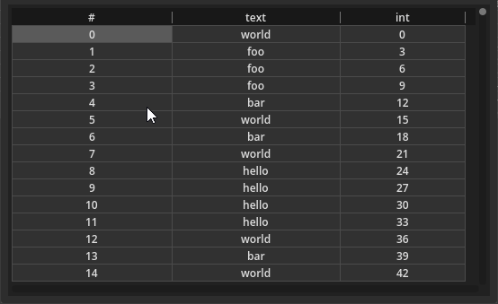

# DataView UI Control for Godot 4.x
This add a control called DataView, which is made to display efficiently a lot of data, like the results of an SQL request (gotten the godot-sqlite project) or whichever data that a custom function returns.
The control only renders the data shown to be efficient and can display a table with $`2^{53} - 1`$ rows maximum.



## Usage
First, you need to add the DataView control in the scene tree, then specify a data provider node in the property of the control.
The data provider must adhere to a contract like what's shown in the example bellow.
```gdscript
extends Node

signal data_changed

func get_row_count() -> int:
    return int(pow(2, 53) - 1)

func get_headers():
    return ["#", "text", "int"]


const arr = ["foo", "bar", "hello", "world"]

func get_row(row_index: int) -> Array:
    return [row_index, arr[hash(row_index)%arr.size()], 3.0 * row_index]
```
The signal `data_changed` must be called to notify the control to redraw its data if it were to change.
The control is themeable, and you can consult the theme file included that contains the fallback values to know what you can customize.

There is currently no way to edit data.
